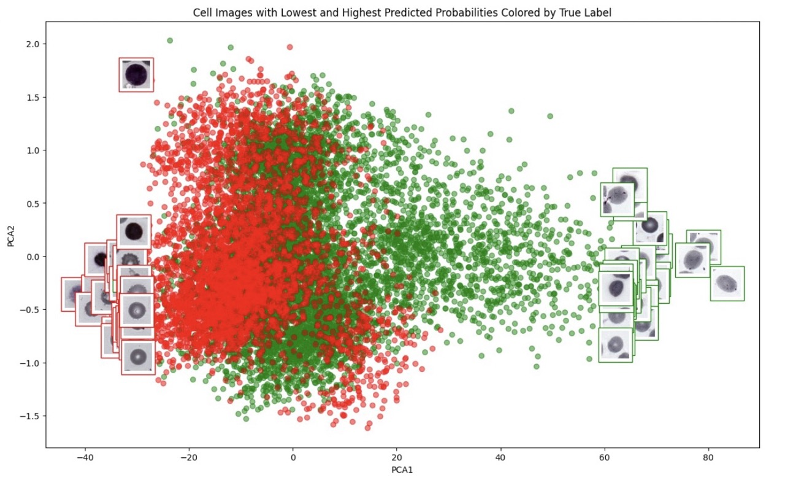

# Leveraging Deep Learning for Detecting Red Blood Cell Morphological Changes in Blood Films from Patients with Severe Malaria Anaemia</h1>

<p align="center">
  
  
  
  
  
</p>

## Abstract

Date:  Feb 2024

In West sub-Saharan Africa, where malaria significantly impacts public health, Severe Malaria Anaemia (SMA) is a critical challenge, particularly affecting children under five. The acute drop of haematocrit observed in SMA patients led us to hypothesise that the suspected increased phagocytotic pathological process in the spleen leads to the presence of distinct Red Blood Cells (RBCs) with altered morphological characteristics, and therefore, these RBCs could be detected systematically and at scale in Peripheral Blood Films (PBFs) by harnessing the capabilities of deep learning models. The assessment of PBFs through manual microscopy does not scale for this task; it is time-intensive and subject to variability. To tackle this, we introduce a deep learning model, leveraging a weakly supervised Multiple Instance Learning framework to Identify SMA (MILISMA) through the presence of morphologically changed RBCs. By training on a dataset comprising 43 SMA and 68 non-SMA patient samples, MILISMA achieved a classification accuracy of 83%, sensitivity of 78%, and specificity of 86%, with an ROC AUC of 87% and Precision-Recall AUC of 76%. More importantly, MILISMA's capabilities extend to identifying statistically significant morphological distinctions (p < 0.01) in RBCs descriptors such as area, area filled, equivalent diameter, and convex area. Our findings are enriched by visual analyses, which underscore the unique morphological features of SMA-affected RBCs, including reduced size and more pronounced pitting and irregularity, compared to non-SMA cells. This model aided detection and characterization of RBC alterations could not only enhance the understanding of SMA's pathology but also be used to refine SMA diagnostic and prognostic evaluation processes at scale potentially leading to better patient outcomes through faster and more accurate diagnoses. Our work underscores the potential of deep learning in revolutionizing clinical pathways in malaria-endemic regions.

## Setup

### Setting up a virtual environment
First, clone the repository:

```bash
git clone https://github.com/ezermoysis1/sma-detection-in-blood-samples
```

Change your directory to where you cloned the files:

```bash
cd sma-detection-in-blood-samples
```

Create a virtual environment with Python 3.11.3 or above:

```bash
virtualenv venv --python=python3.11.3 (or python3.11.3 -m venv venv or conda create -n multiqa python=3.11.3)
```

Activate the virtual environment. You will need to activate the venv environment in each terminal in which you want to use the project.

```bash
source venv/bin/activate (or source venv/bin/activate.csh or conda activate multiqa)
```

Install the required dependencies:

```bash
pip install -r requirements.txt
```

## Use the code

### Dataset

#### Clinical malaria microscopy

Thin Blood Films (TBFs) are first stained with Giemsa at clinics in the University College Hospital (UCH) in the city of Ibadan, Nigeria. Malaria affected cells are detected and counted by human-expert microscopists. A patient is declared malaria positive, if at least one malaria affected erythrocyte (i.e. red blood cell with malaria parasite) is detected in 100 high magnification (100x) TBF Field of Views (FoVs). In addition, a patient is declared Severe Malaria Anaemia (SMA) positive if they are malaria positive and have Packed Cell Volume (PCV) percentage lower than 16%. PCV is clinically a good proxy for measuring level of haemoglobin (Hb) concentration. Based on the PCV concentration, SMA negative patients are sub-classified based on presence of malaria and or anaemia as discussed in Section. The corresponding films are then digitized, processed, and used to train and evaluate our MILISMA models.

#### Data Acquisition

Images from Giemsa-stained thin blood smears are obtained using an Olympus BX63 upright brightfield microscope equipped with a 100X/1.4NA lens, a Prior Scientific motorized stage, and an Edge 5.5c, PCO color camera. The captured image from each field spans 166μm x 142μm, translating to a resolution of 2560x2160 pixels. For every position, a z-stack of 14 different focal levels, distanced at 0.5μm intervals, is recorded with an exposure duration of 50ms. These z-stacks are then merged into one single plane using a wavelet-enhanced depth of field method.

 

#### Data sets

The entire consists of 126 samples of TBF FoV images. These images will also be referred to in this report as Whole-Slide images (WSI). For each sample, 3 to 20 WSIs have been acquired. Most samples have 5 or 10 images, with some having up to 20. All these images have a size of [2160,2560,3]. The split of non-SMA and SMA samples is 83 (66%) / 43 (34%).


#### Ethical Statement

The internationally recognized ethics committee at the Institute for Advanced Medical Research and Training (IAMRAT) of the College of Medicine, University of Ibadan (COMUI) approved this research with permit numbers: UI/EC/10/0130, UI/EC/19/0110. Parents and/or guardians of study participants gave informed written consent in accordance with the World Medical Association ethical principles for research involving human subjects.

### Methods


#### RBC segmentation & cleaning

To extract RBC images from TBF images run the following. Make sure that your TBF images are stored in 'data/whole_slide_images'. The RBC images will be stored in 'data/rbc_images' folder.

```bash
python segmentation.py
```


To remove unwanted images and clean the dataset (before training), run the following. Please refer to the paper for more information on this. This will create a new subdir inside data folder called 'rbc_images_cleaned' which will be identical to 'rbc_images' but will have removed the images that are undesirable.

```bash
python clean_images.py
```

#### Training: Multiple Instance Learning for SMA Identification (MILISMA) model


Train MILISMA models using the following:

```bash
python train.py
```

Hyperparameters and path definitions are set in the config files.

### Results

#### Results - Model configuration comparison

To evaluate a model or a model configuration on the test set, run:

```bash
python evaluate.py
```

Hyperparameters and path definitions are set in the config files.


#### Results - RBC morphology

Using the MILISMA model that we have trained, we perform the RBC morphological investigation, running the following script. This prints some graphs among which

```bash
python rbc_morph_investigation.py
```

1) The visual comparison of the 40 cells that MILISMA classified as SMA and non-SMA with the highest certainty:


2) The comparative analysis (including statistical analysis) of the morhological characteristics of these cells:


3) Principal Component Analysis (PCA) analysis on all cells in dataset from the last linear layer of the MILISMA neural network:



4) Percentage of SMA positive classified cells per clinical case:


## Authors

- [@ezermoysis1] Ezer Moysis (ezer.moysis22@ucl.ac.uk)
- [@petremanescu] Petru Manescu (p.manescu@ucl.ac.uk)
- Delmiro Fernandez Reyes (delmiro.fernandezreyes@ucl.ac.uk)

## Documentation
Please read the full paper of the project [here](https://drive.google.com/file/d/1q6poeg_jp8Jiogm4ZcSV2xcVPzC3olUX/view?usp=drive_link)
