# MSc Dissertation: Detecting Severe Malaria Anaemia and investigating the morphological characteristics of red blood cells at its presence

## Project Description

UCL MSc Final Project

Date: Sept 2023

Severe Malaria Anaemia (SMA) poses a significant healthcare challenge in malaria-endemic regions, with considerable mortality rates, especially among children under five. In this project, a detailed pipeline is presented, which automates the detection of SMA from red blood cell images segmented from thin blood film samples. To achieve this, the Multiple Instance Learning for SMA detection (MILSMA) model is proposed. This uses deep learning, combining pre-trained convolutional neural network layers from ResNet50 with Multiple Instance Learning pooling techniques to classify blood samples as SMA negative or positive, using labels corresponding to bags of cells images, eliminating the need for intricate, expensive and hard to obtain per-image annotations. Several MILSMA models have been trained on both balanced and imbalanced datasets, employing different rebalancing techniques and Multiple Instance Learning pooling methods, and their performance has been compared. Further, utilizing the trained MILSMA models, a systematic comparison is conducted revealing pronounced morphological differences between red blood cells classified as SMA negative and SMA positive. Notably, SMA positive cells are smaller and have a perimeter which appears 'pitted' and with many sharp edges compared to their SMA-negative ones. This research harbors the potential for automated SMA detection in resource-constrained settings, offers valuable insights for understanding the underlying pathophysiological mechanisms of this condition and lays the foundation for forthcoming studies on SMA.

## Setup

### Setting up a virtual environment
First, clone the repository:

```bash
git clone https://github.com/ezermoysis1/malaria-detection-in-blood-samples
```

Change your directory to where you cloned the files:

```bash
cd malaria-detection-in-blood-samples
```

Create a virtual environment with Python 3.11.3 or above:

```bash
virtualenv venv --python=python3.11.3 (or python3.11.3 -m venv venv or conda create -n multiqa python=3.11.3)
```

Activate the virtual environment. You will need to activate the venv environment in each terminal in which you want to use the project.

```bash
source venv/bin/activate (or source venv/bin/activate.csh or conda activate multiqa)
```

Install the required dependencies:

```bash
pip install -r requirements.txt
```
    
## Use the code

### Dataset

#### Clinical malaria microscopy

Thin Blood Films (TBFs) are first stained with Giemsa at clinics in the University College Hospital (UCH) in the city of Ibadan, Nigeria. Malaria affected cells are detected and counted by human-expert microscopists. A patient is declared malaria positive, if at least one malaria affected erythrocyte (i.e. red blood cell with malaria parasite) is detected in 100 high magnification (100x) TBF Field of Views (FoVs). In addition, a patient is declared Severe Malaria Anaemia (SMA) positive if they are malaria positive and have Packed Cell Volume (PCV) percentage lower than 16%. PCV is clinically a good proxy for measuring level of haemoglobin (Hb) concentration. Based on the PCV concentration, SMA negative patients are sub-classified based on presence of malaria and or anaemia as discussed in Section. The corresponding films are then digitized, processed, and used to train and evaluate our MILSMA models. 

#### Data Acquisition

Images from Giemsa-stained thin blood smears are obtained using an Olympus BX63 upright brightfield microscope equipped with a 100X/1.4NA lens, a Prior Scientific motorized stage, and an Edge 5.5c, PCO color camera. The captured image from each field spans 166μm x 142μm, translating to a resolution of 2560x2160 pixels. For every position, a z-stack of 14 different focal levels, distanced at 0.5μm intervals, is recorded with an exposure duration of 50ms. These z-stacks are then merged into one single plane using a wavelet-enhanced depth of field method.

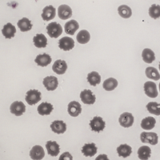 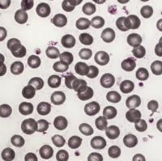 |

#### Data sets

Original Dataset: The entire dataset used for the scope of this project consists of 128 samples of TBF FoV images. These images will also be referred to in this report as Whole-Slide images (WSI). For each sample, 3 to 20 WSIs have been acquired. Most samples have 5 or 10 images, with some having up to 20. In total, the WSIs in the dataset add up to 1,207. All these images have a size of [2160,2560,3]. The split of non-SMA and SMA samples is 95 (74%) / 33 (26%). Once RBC segmentation is performed, 15,178 RBC images are extracted from the WSIs.

Imbalanced Dataset: After data curation of the RBC segmented images of the original dataset is performed, the resulting dataset is one of the two datasets that are used in training, the imbalanced dataset. This consists of 104 samples with an imbalanced non-SMA and SMA split of 75 (72%) / 29 (28%). This dataset consists of 10,638 RBC images. 

Balanced Dataset: A balanced version of the imbalanced dataset is then created, by randomly selecting 29 non-SMA samples and keeping all the SMA samples from the imbalanced dataset. This will be referred to as the balanced dataset. This dataset consists of 5,837 RBC images and is used to compare how the performance metrics of models trained with each of the two datasets differ. 

The three datasets and the process for obtaining the two last ones are visually described in the Figure below. In the same figure, the breakdown of SMA negative samples (or Non-SMA as it appears in the figure) into sub-classes is also provided. These sub-classes (Malaria & Anaemia No severe, Malaria & No Amaemia, Malaria & Severe Anaemia No SMA, No Malaria & Anaemia, No Malaria & No Anaemia, No Malaria & Severe Anaemia, Unclassified and SMA) are given based on the clinical diagnosis and take into account the presence of parasitemia and PCV count. These sub-classes provide a deeper understanding of the SMA negative class.

Comment on size of dataset: It is worth highlighting that the amount of data that is included in this study is relatively small compared to other studies of automatic malaria detection. In particular, given the complexity of the task and the machine learning techniques used to train the models, a much larger number of samples should be used, and especially for the underrepresented SMA class.

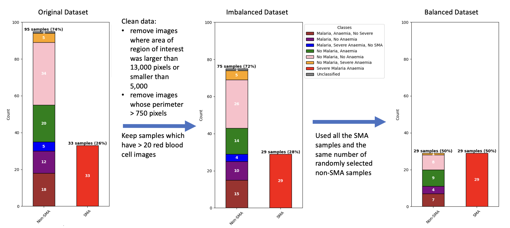

#### Ethical Statement

The internationally recognized ethics committee at the Institute for Advanced Medical Research and Training (IAMRAT) of the College of Medicine, University of Ibadan (COMUI) approved this research with permit numbers: UI/EC/10/0130, UI/EC/19/0110. Parents and/or guardians of study participants gave informed written consent in accordance with the World Medical Association ethical principles for research involving human subjects.

### Methods

The process begins by extracting RBCs from Whole-Slide sample images (WSI), transforming the original images, and applying a series of filters, adaptive thresholding, and morphological operations, ensuring precise and optimal segmentation of individual RBCs. Post-segmentation, data pre-processing (data curating) is performed to eliminate images where segmentation has either inadvertently captured multiple RBCs in a single frame or failed to capture any. For each sample, all the extracted RBCs are stored in a distinct collection of images, called 'bag of cells', that also carries the binary label of the bag (0 SMA negative and 1 for SMA positive sample). The bags of cells are split into training and test and the ones in the training set are fed in the model for training. The model performs Multiple Instance Learning and utilizes the first layers of ResNet-50 model for feature extraction, and dense fully connected layers for this particular binary classification downstream task. Techniques such as data augmentation, oversampling and cost-sensitive training are employed to mitigate overfitting, and imbalanced dataset biases. Comprehensive performance metrics for model evaluation are detailed, presenting a transparent assessment of the models' efficacy. Finally, morphological analysis and explainable visualisation methods, such as GradCAM++ are incorporated to better understand the morphological differences between characteristic RBCs of SMA negative and SMA positive patients. The end-to-end process is summarised in the Figure below.

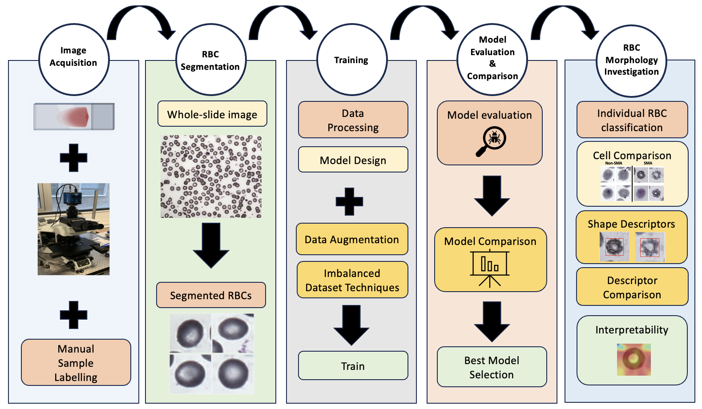

#### RBC segmentation

Use 
```bash
rbc_segmentation.ipynb
```

Images are first transformed to grayscale, followed by the application of Gaussian blur for noise reduction. To segregate the RBCs from the background, an adaptive thresholding technique using the Otsu method is applied. Morphological operations are further applied to this binary image. An opening operation is performed using a 3x3 kernel to remove noise. This is then dilated to ensure that the RBCs are separated from each other. To identify the definite background and the foreground, a distance transform is applied, which calculates the distance from each pixel to the nearest zero-pixel. A threshold is set to separate the sure foreground (RBCs) regions. The regions which are neither the definite foreground nor the definite background are termed as 'unknown'. The watershed algorithm is used on these regions to ensure proper segmentation of touching cells. After this step, the segmented image undergoes a series of post-processing steps. Small unwanted objects are removed, and the final segmented RBCs are extracted.

The next task is to extract thumbnails or small cropped images containing RBCs from the segmented image. This is accomplished by first finding the connected components from the segmented image. For each connected component, a bounding box area is computed, and its ratio concerning the whole image is checked. Thumbnails are extracted only for those bounding boxes that fall within a specified area ratio, ensuring that only relevant and well-sized RBC images are considered. Images from the bounding box around each segented cell are shown below. Through this methodology, RBCs are effectively segmented from WSIs, and relevant thumbnails are extracted, ensuring that RBCs are clearly visible and distinguishable.

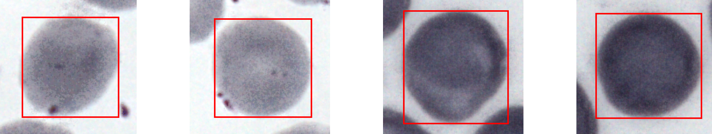

#### Multiple Instance Learning for SMA Identification (MILSMA) model 

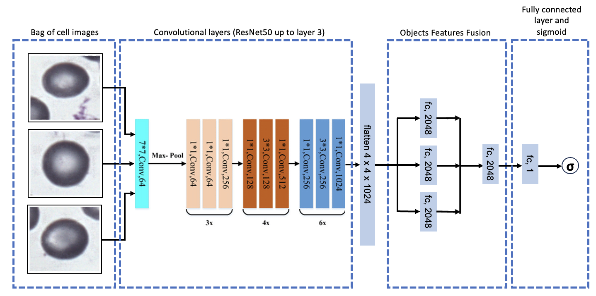

Multiple Instance Learning for SMA Identification (MILSMA) models are trained to distinguish between SMA negative and SMA positive samples. For each sample, patches or bags containing individual cells are being used to train a weakly-supervised convolutional neural network model with diagnostic labels. More specifically, MILSMA models are  trained to differentiate between bags of cells from positive samples (containing both regular and abnormal red blood cells) and bags of cells instances extracted from negative samples (only regular cells).

As the name suggests, the architecture of MILSMA models makes use of the Multiple Instance Learning (MIL) paradigm. Multiple Instance Learning is a variant of supervised machine learning where a single label is associated with a bag (or collection) of instances, rather than individual instances. In an MIL setting, a positive bag implies that at least one instance within the bag is positive, while a negative bag guarantees that all instances within are negative. This approach is particularly useful for tasks where annotating individual instances is challenging or ambiguous, but bag-level labels can be readily obtained. 

In addition, the architecture makes use of the pre-trained ResNet-50 model, which has been trained on ImageNet database, by retaining most of its layers. Specifically, it keeps layers from the beginning of the network up layer 3 (or alternatively up to and including the 6th child). This portion of ResNet-50 effectively captures various image features from simple to more complex representations. However, the last three layers (which usually include a larger convolutional layer, global average pooling and the final classification layer) are excluded, allowing for a bespoke pooling and aggregation mechanism detailed further below. While training, the weights of the ResNet-50 layers are frozen, and therefore not updated during the training. This preserves the image feature extraction capability of ResNet-50 while only updating the weights of the custom layers added on top. A key motivation for adopting the transfer learning approach, specifically by utilizing pre-trained ResNet-50 weights, stems from the practical constraints related to training deep neural networks from scratch. Training such models with millions of parameters can be computationally expensive and time-consuming. Starting with random weights for such a deep architecture would necessitate many epochs to converge to a reasonably good local minimum. Without staring from pre-trained weights it would be difficult to train models given the limited amount of data and if that was possible, it would have been a very slow process.

After feature extraction using the ResNet-50 layers, one dense layer (FC1) is used to reduce the dimensionality from [4x4x1024], which corresponds to the number of flattened features of the last convolutional layer, to 2048. At this stage, each input RBC image is represented by a single 2048 length vector.

An aggregation (or feature fusion) function is then used to fuse the vectors of each RBC image into a single 2048 length vector that captures the aggregate information of each individual RBC in order to make a final decision about the predicted class of each bag of cells. This process is called Objects Features Fusion (OFF). Eventually, the single feature vector is passed through a final fully connected layer (FC2) that reduces dimensionality from 2048 to 1 and has a sigmoid activation function, constraining the output to the [0,1] range, effectively assigning a predicted class (0 for SMA negative and 1 for SMA positive) to the bag of cells.


### Results

#### Results - Model configuration comparison

MILSMA models (1-5) have been trained on the balanced dataset. Their performance is presented below:
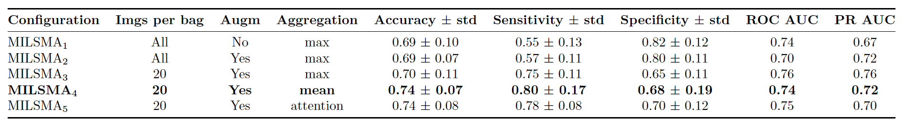

MILSMA models (6-14) and MILSMA (baseline) have been trained on the imbalanced dataset. Their performance is presented below:
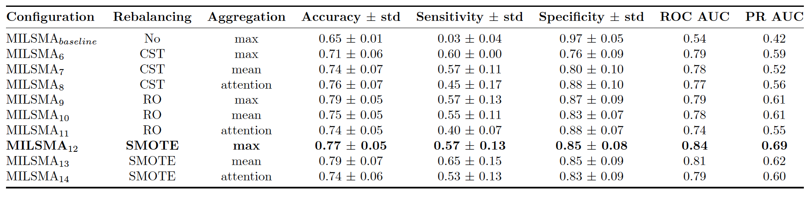

To evaluate a model or a model configuration on the test run:
```bash
python main_pt.py evaluate
```

In order to choose the best model to perform classify the RBC images separately, the best model needs to be selected. This is done by choosing the best model from each of the two best performing configurations 


#### Results - RBC morphology

Using the best trained MILSMA model, RBCs are classified as SMA negative or SMA positive. The most confidently predicted SMA negative and SMA positive RBCs are shown below:

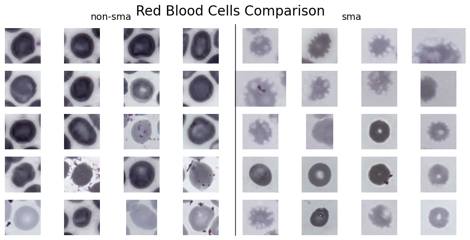

For these cells morphological descriptors are obtained using '''scikit-image.measure''' and are compared below:

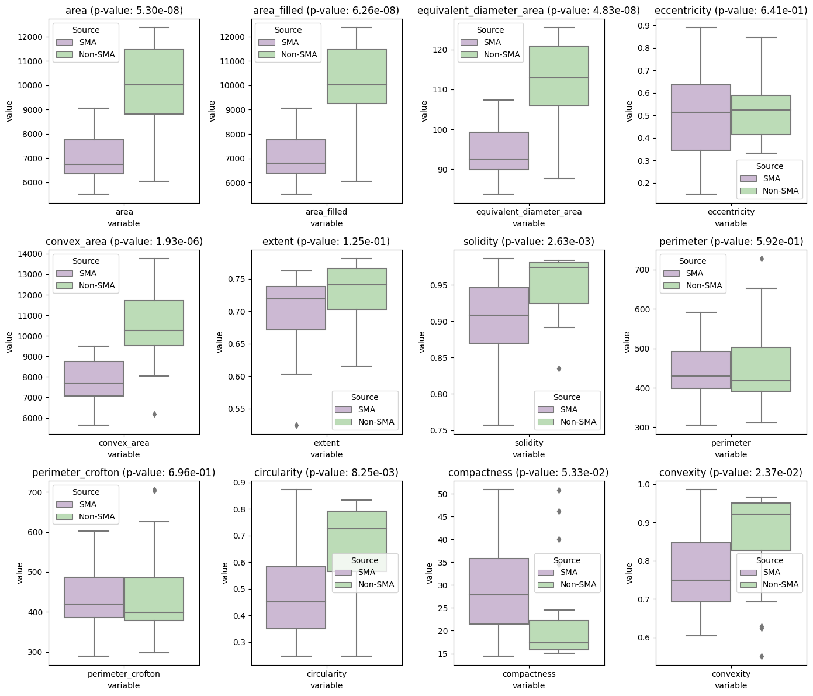

GradCAM++ visualizations are run:

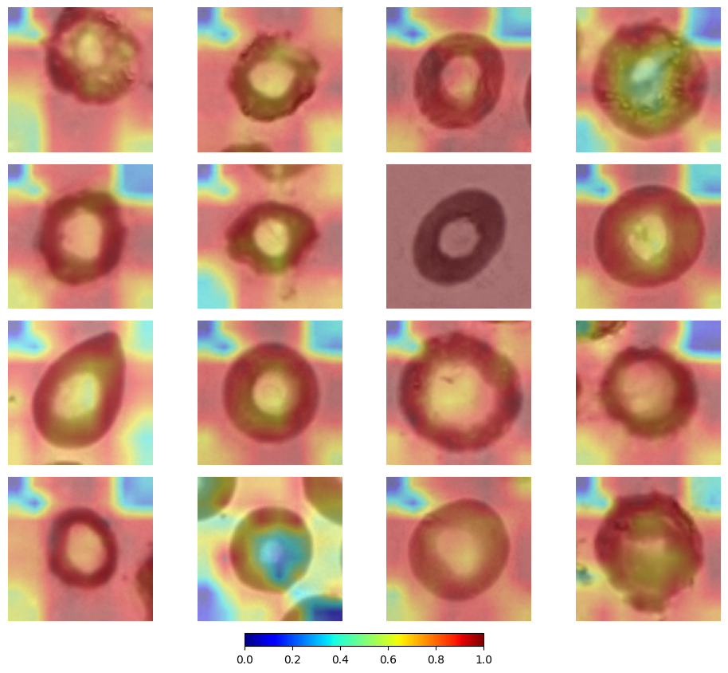


## Authors

- [@ezermoysis1](https://github.com/ezermoysis1)

## Documentation
Please read the full report of the project [here](https://drive.google.com/file/d/1zX3HGt0AiCVF5MfM4lKS9Ag_boOhq-_c/view?usp=sharing)