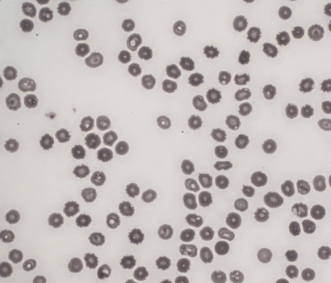
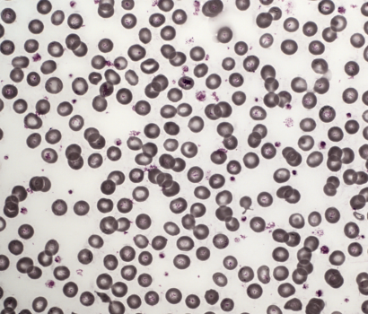
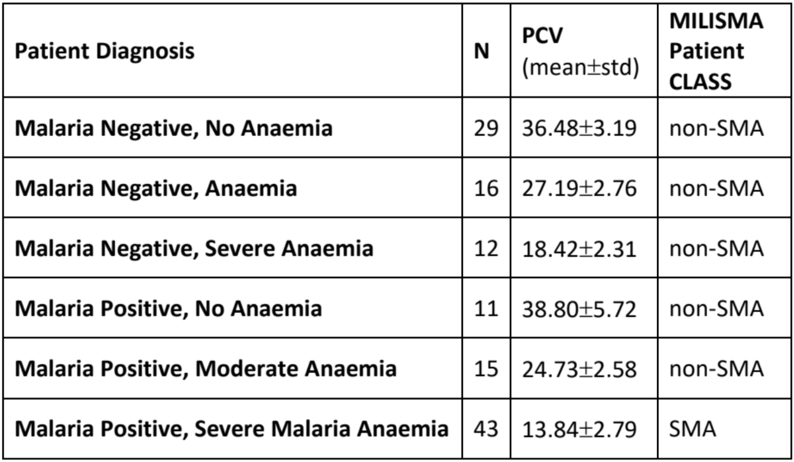
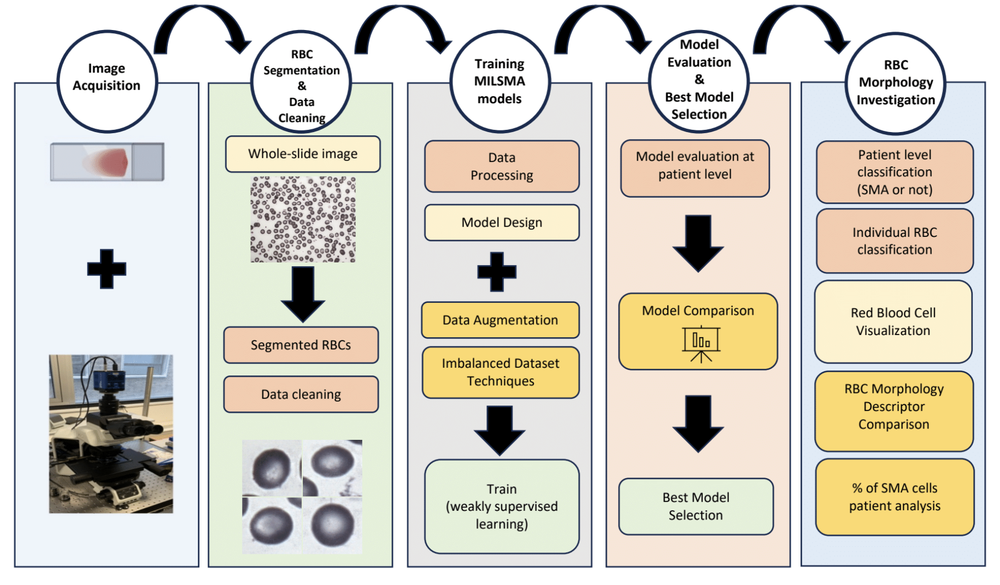
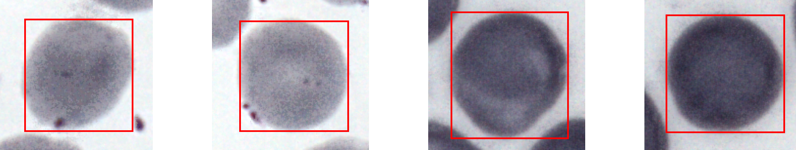
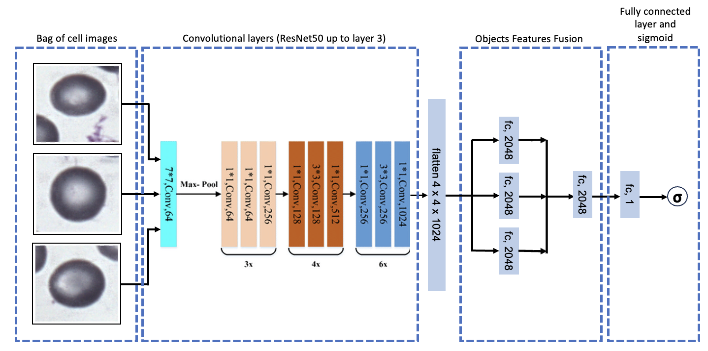
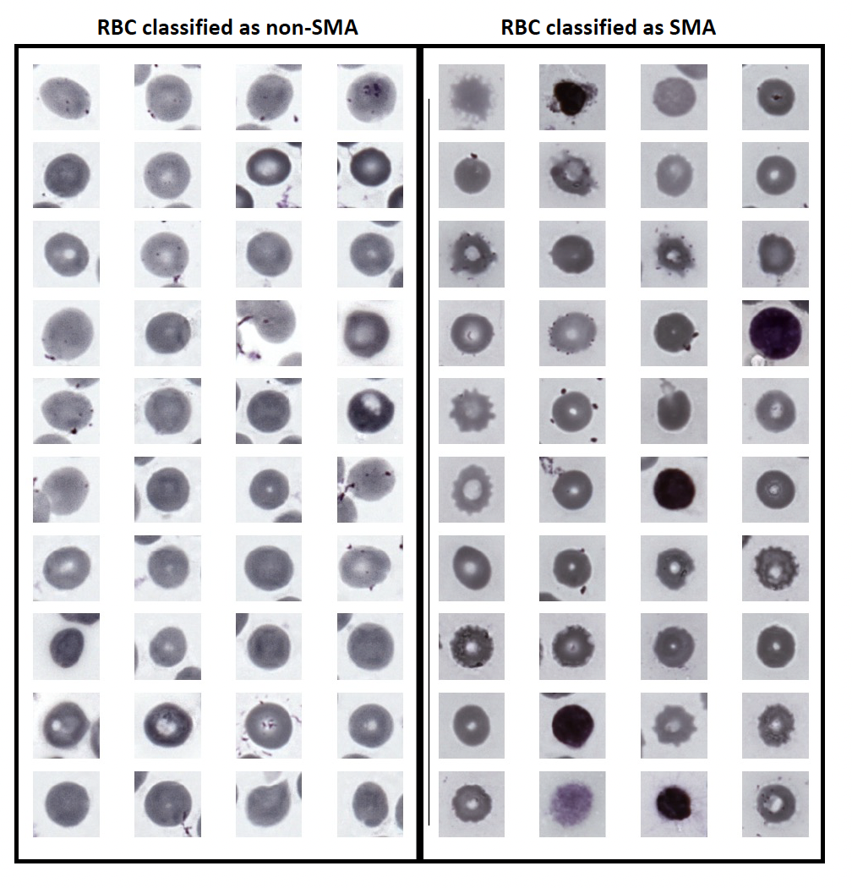
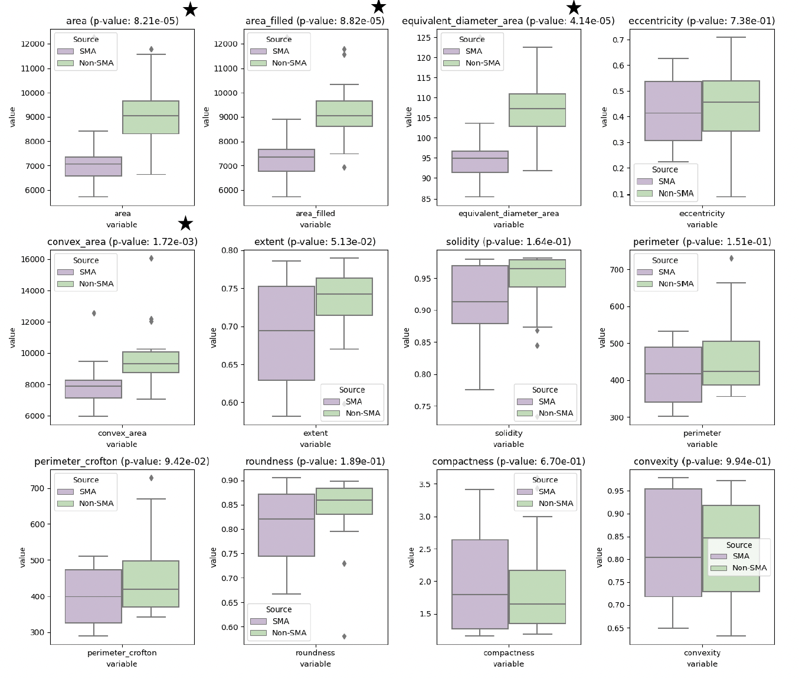
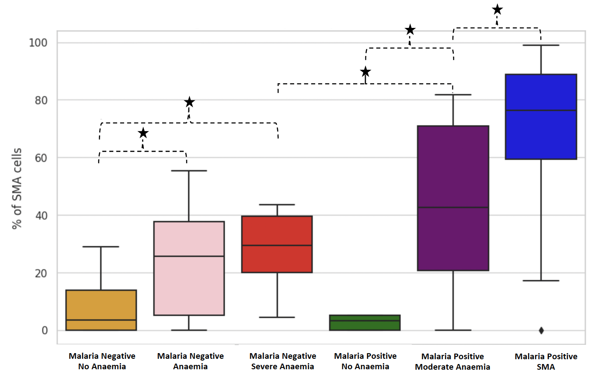

# Leveraging Deep Learning for Detecting Red Blood Cell Morphological Changes in Blood Films from Patients with Severe Malaria Anaemia

## Project Description

Date:  Feb 2024

In West sub-Saharan Africa, where malaria significantly impacts public health, Severe Malaria Anaemia (SMA) is a critical challenge, particularly affecting children under five. The acute drop of haematocrit observed in SMA patients led us to hypothesise that the suspected increased phagocytotic pathological process in the spleen leads to the presence of distinct Red Blood Cells (RBCs) with altered morphological characteristics, and therefore, these RBCs could be detected systematically and at scale in Peripheral Blood Films (PBFs) by harnessing the capabilities of deep learning models. The assessment of PBFs through manual microscopy does not scale for this task; it is time-intensive and subject to variability. To tackle this, we introduce a deep learning model, leveraging a weakly supervised Multiple Instance Learning framework to Identify SMA (MILISMA) through the presence of morphologically changed RBCs. By training on a dataset comprising 43 SMA and 68 non-SMA patient samples, MILISMA achieved a classification accuracy of 83%, sensitivity of 78%, and specificity of 86%, with an ROC AUC of 87% and Precision-Recall AUC of 76%. More importantly, MILISMA's capabilities extend to identifying statistically significant morphological distinctions (p < 0.01) in RBCs descriptors such as area, area filled, equivalent diameter, and convex area. Our findings are enriched by visual analyses, which underscore the unique morphological features of SMA-affected RBCs, including reduced size and more pronounced pitting and irregularity, compared to non-SMA cells. This model aided detection and characterization of RBC alterations could not only enhance the understanding of SMA's pathology but also be used to refine SMA diagnostic and prognostic evaluation processes at scale potentially leading to better patient outcomes through faster and more accurate diagnoses. Our work underscores the potential of deep learning in revolutionizing clinical pathways in malaria-endemic regions.

## Setup

### Setting up a virtual environment
First, clone the repository:

```bash
git clone https://github.com/ezermoysis1/sma-detection-in-blood-samples
```

Change your directory to where you cloned the files:

```bash
cd sma-detection-in-blood-samples
```

Create a virtual environment with Python 3.11.3 or above:

```bash
virtualenv venv --python=python3.11.3 (or python3.11.3 -m venv venv or conda create -n multiqa python=3.11.3)
```

Activate the virtual environment. You will need to activate the venv environment in each terminal in which you want to use the project.

```bash
source venv/bin/activate (or source venv/bin/activate.csh or conda activate multiqa)
```

Install the required dependencies:

```bash
pip install -r requirements.txt
```

## Use the code

### Dataset

#### Clinical malaria microscopy

Thin Blood Films (TBFs) are first stained with Giemsa at clinics in the University College Hospital (UCH) in the city of Ibadan, Nigeria. Malaria affected cells are detected and counted by human-expert microscopists. A patient is declared malaria positive, if at least one malaria affected erythrocyte (i.e. red blood cell with malaria parasite) is detected in 100 high magnification (100x) TBF Field of Views (FoVs). In addition, a patient is declared Severe Malaria Anaemia (SMA) positive if they are malaria positive and have Packed Cell Volume (PCV) percentage lower than 16%. PCV is clinically a good proxy for measuring level of haemoglobin (Hb) concentration. Based on the PCV concentration, SMA negative patients are sub-classified based on presence of malaria and or anaemia as discussed in Section. The corresponding films are then digitized, processed, and used to train and evaluate our MILISMA models.

#### Data Acquisition

Images from Giemsa-stained thin blood smears are obtained using an Olympus BX63 upright brightfield microscope equipped with a 100X/1.4NA lens, a Prior Scientific motorized stage, and an Edge 5.5c, PCO color camera. The captured image from each field spans 166μm x 142μm, translating to a resolution of 2560x2160 pixels. For every position, a z-stack of 14 different focal levels, distanced at 0.5μm intervals, is recorded with an exposure duration of 50ms. These z-stacks are then merged into one single plane using a wavelet-enhanced depth of field method.

  |

#### Data sets

Original Dataset: The entire dataset used for the scope of this project consists of 128 samples of TBF FoV images. These images will also be referred to in this report as Whole-Slide images (WSI). For each sample, 3 to 20 WSIs have been acquired. Most samples have 5 or 10 images, with some having up to 20. In total, the WSIs in the dataset add up to 1,207. All these images have a size of [2160,2560,3]. The split of non-SMA and SMA samples is 95 (74%) / 33 (26%). Once RBC segmentation is performed, 15,178 RBC images are extracted from the WSIs.

Imbalanced Dataset: After data curation of the RBC segmented images of the original dataset is performed, the resulting dataset is one of the two datasets that are used in training, the imbalanced dataset. This consists of 104 samples with an imbalanced non-SMA and SMA split of 75 (72%) / 29 (28%). This dataset consists of 10,638 RBC images.

Balanced Dataset: A balanced version of the imbalanced dataset is then created, by randomly selecting 29 non-SMA samples and keeping all the SMA samples from the imbalanced dataset. This will be referred to as the balanced dataset. This dataset consists of 5,837 RBC images and is used to compare how the performance metrics of models trained with each of the two datasets differ.

The three datasets and the process for obtaining the two last ones are visually described in the Figure below. In the same figure, the breakdown of SMA negative samples (or Non-SMA as it appears in the figure) into sub-classes is also provided. These sub-classes (Malaria & Anaemia No severe, Malaria & No Amaemia, Malaria & Severe Anaemia No SMA, No Malaria & Anaemia, No Malaria & No Anaemia, No Malaria & Severe Anaemia, Unclassified and SMA) are given based on the clinical diagnosis and take into account the presence of parasitemia and PCV count. These sub-classes provide a deeper understanding of the SMA negative class.

Comment on size of dataset: It is worth highlighting that the amount of data that is included in this study is relatively small compared to other studies of automatic malaria detection. In particular, given the complexity of the task and the machine learning techniques used to train the models, a much larger number of samples should be used, and especially for the underrepresented SMA class.




#### Ethical Statement

The internationally recognized ethics committee at the Institute for Advanced Medical Research and Training (IAMRAT) of the College of Medicine, University of Ibadan (COMUI) approved this research with permit numbers: UI/EC/10/0130, UI/EC/19/0110. Parents and/or guardians of study participants gave informed written consent in accordance with the World Medical Association ethical principles for research involving human subjects.

### Methods

The process begins by extracting RBCs from Whole-Slide sample images (WSI), transforming the original images, and applying a series of filters, adaptive thresholding, and morphological operations, ensuring precise and optimal segmentation of individual RBCs. Post-segmentation, data pre-processing (data curating) is performed to eliminate images where segmentation has either inadvertently captured multiple RBCs in a single frame or failed to capture any. For each sample, all the extracted RBCs are stored in a distinct collection of images, called 'bag of cells', that also carries the binary label of the bag (0 SMA negative and 1 for SMA positive sample). The bags of cells are split into training and test and the ones in the training set are fed in the model for training. The model performs Multiple Instance Learning and utilizes the first layers of ResNet-50 model for feature extraction, and dense fully connected layers for this particular binary classification downstream task. Techniques such as data augmentation, oversampling and cost-sensitive training are employed to mitigate overfitting, and imbalanced dataset biases. Comprehensive performance metrics for model evaluation are detailed, presenting a transparent assessment of the models' efficacy. Finally, morphological analysis and explainable visualisation methods, such as GradCAM++ are incorporated to better understand the morphological differences between characteristic RBCs of SMA negative and SMA positive patients. The end-to-end process is summarised in the Figure below.



#### RBC segmentation & cleaning

To extract RBC images from TBF images run the following. Make sure that your TBF images are stored in 'data/whole_slide_images'. The RBC images will be stored in 'data/rbc_images' folder.

```bash
python segmentation.py
```




To remove unwanted images and clean the dataset (before training), run the following. Please refer to the paper for more information on this. This will create a new subdir inside data folder called 'rbc_images_cleaned' which will be identical to 'rbc_images' but will have removed the images that are undesirable.

```bash
python clean_images.py
```

#### Training: Multiple Instance Learning for SMA Identification (MILISMA) model



Train MILISMA models using the following:

```bash
python train.py
```


### Results

#### Results - Model configuration comparison

To evaluate a model or a model configuration on the test set, run:

```bash
python evaluate.py
```

#### Results - RBC morphology

Using the MILISMA model that we have trained, we perform the RBC morphological investigation, running the following script. This prints some graphs among which

```bash
python rbc_morph_investigation.py
```

1) The visual comparison of the 40 cells that MILISMA classified as SMA and non-SMA with the highest certainty:



2) The comparative analysis (including statistical analysis) of the morhological characteristics of these cells:



3) Principal Component Analysis (PCA) analysis on all cells in dataset from the last linear layer of the MILISMA neural network:


4) Percentage of SMA positive classified cells per clinical case:




## Authors & Contributions

- [@ezermoysis1](https://github.com/ezermoysis1)
- Delmiro Fernandez Reyes (delmiro.fernandezreyes@ucl.ac.uk)
- Petru Manescu (p.manescu@ucl.ac.uk)


## Documentation
Please read the full report of the project [here](https://drive.google.com/file/d/1q6poeg_jp8Jiogm4ZcSV2xcVPzC3olUX/view?usp=drive_link)
